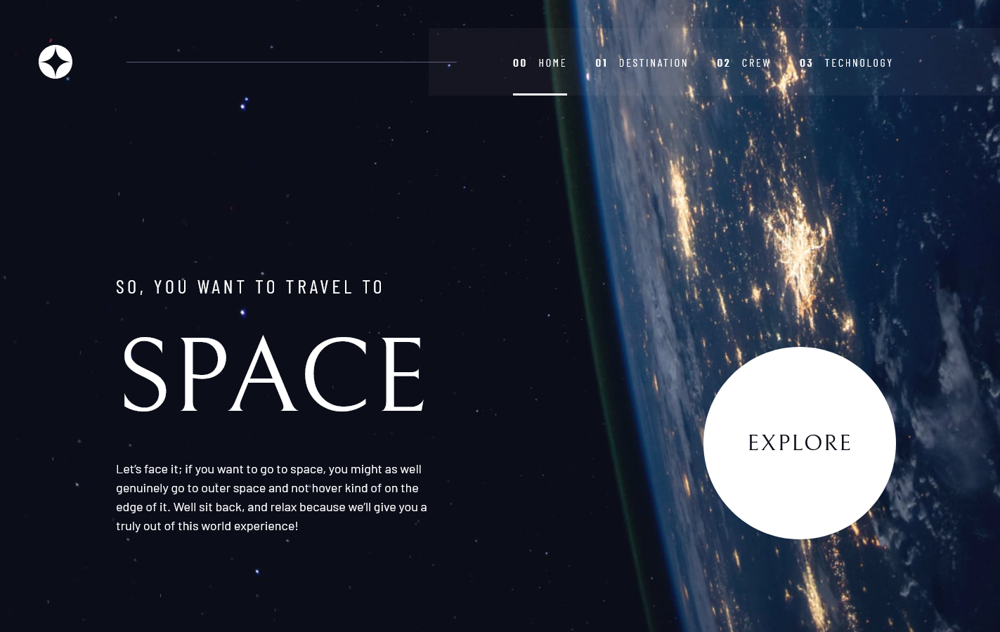
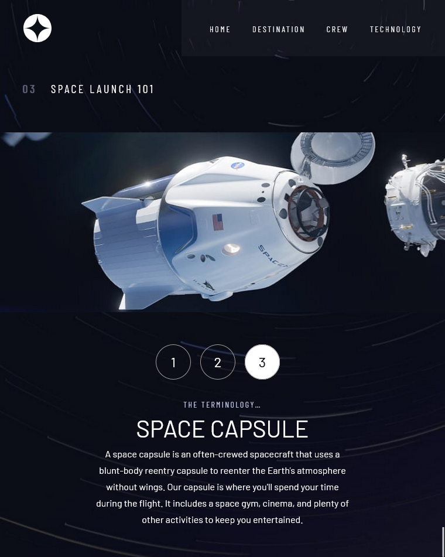
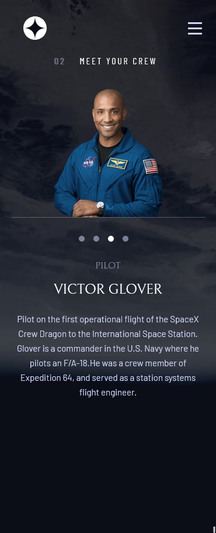

# Space Tourism Front mentor mobile responsive  challenge

## For live preview click  <strong>[link](https://astonishing-eclair-1afa9e.netlify.app)</strong> 

## Desktop design overview home page

## Tablet design overview  technology page

## Mobile design overview  crew page

## Development setup
1. Clone it
2. npm install
3. npm run dev

##  About Space Tourism
> This project is a front mentor challenge ( [Front Mentor link ](https://www.frontendmentor.io/home))

## Build With

1. SASS
1. TYPESCRIPT
1. REACT.JS

